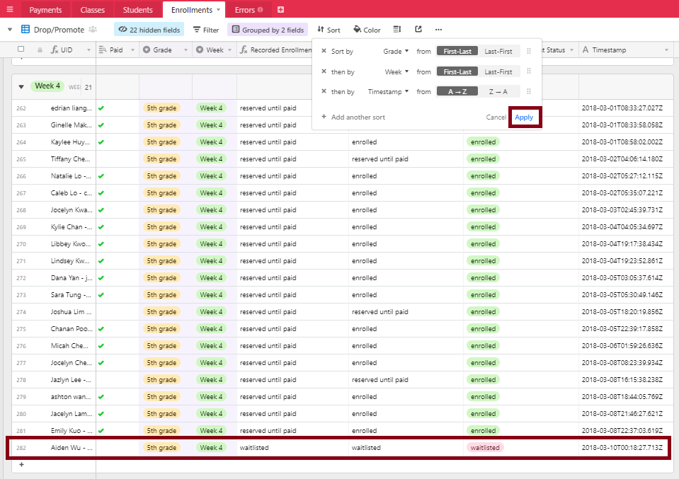
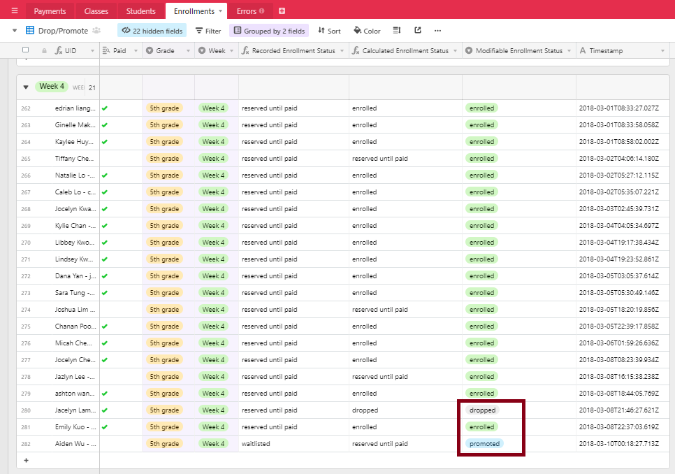

# Dropping and Promoting students

Say Jacelyn Lam (5th grade) wanted to drop Week 4, but there is a currently a wailist for the 5th grade - Week 4 class.

First use Airtable to figure out who should be promoted, then make the changes on the Spreadsheet, which will be reflected on Google Form through **formRanger**.

## Airtable:
1. On the **Enrollments** tab, go to the  **Drop/Promote** view, and **Sort** by Grade then Week then Timestamp, click **Apply**.
2. Find the student who is first on the waitlist, in this case `Aiden Wu`.  You may want to double check the `Timestamp` and `Paid` fields.
   

3. Change `Aiden Wu`'s **Modifiable enrollment status** to `promoted` and change `Jacelyn Lam`'s **Modifiable enrollment status** to `dropped`.
   

4. To see the changes reflected in **Payment Expected**, go to the **Students** tab, **Payment** view, and update the **Select Week** column accordingly. 
   Unhide and copy the `Payment UID` into `Payment Link` for this student.
5. Verify that the enrollment counts are updated on the **Classes** tab.

 ***NOTE**: ask Chris: how to handle payment when student is waitlisted?*

## Spreadsheet:

 ***IMPORTANT NOTE!** Be sure to promote before dropping so a new registrant cannot enroll ahead of those on the waitlist.*

1. In the `classes` tab, take a screenshot or copy the enrollment counts and paste by value into a blank spreadsheet.
2. In the `Form Responses 1` tab, find `Aiden Wu` 's row in the `Select Week for 5th Grade` column, change to
```
..., Week 4: July 9 - July 13: PROMOTED, ...
```
3. In the `Form Responses 1` tab, find `Jacelyn Lam`'s row in the `Select Week for 5th Grade` column, change to
```
..., Week [4 DROPPED]: July 9 - July 13: [3/20] seats left, ...
```
3. Note changes to enrollment counts in the `classes` tab and ensure changes are also reflected in the `waitlist options` tab.
4. Open the **formRanger** add-on so that the changes are reflected on **Google Form**.
5. Cross check with the enrollment counts on Airtable's **Classes** tab.

# Change weeks

Say Jacelyn Lam (5th grade) wanted a change from weeks 1,4,5,6 to 1,2,3,4.

First make the changes on the spreadsheet, so spots are opened up for new registrants as soon as possible (unless... see note below), then make changes accordingly on Airtable.

## Spreadsheet:
1. In the `classes` tab, take a screenshot or copy the enrollment counts and paste by value into a blank spreadsheet.

    ***IMPORTANT NOTE!** Ensure the student is not dropping a class where there is a waitlist.  In this case, if there are students on the waitlist for 5th grade Weeks 5 or 6, be sure to [promote students](#dropping-and-promoting-students) before dropping Jacelyn, so that new registrants cannot enroll ahead of those currently waitlisted.*
   
2. In the `Form Responses 1` tab, find `Jacelyn`'s row in the `Select Week for 5th Grade` column, change to
```
Week 1: June 18 - June 22: [6/20] seats left, Week 2, Week 3, Week 4: July 9 - July 13: [3/20] seats left
```
   This change will effectively drop Jacelyn for weeks 5 and 6, and add her for weeks 2 and 3.
   
3. Note changes to enrollment counts in the `classes` tab and ensure changes are also reflected in the `waitlist options` tab.
4. Open the **formRanger** add-on so that the changes are reflected on **Google Form**.

## Airtable:
1. On the **Students** tab, (prefer to use **Linked Enrollments** view), `Ctrl+F` to find `Jacelyn`.  
   In the **Select Week** column, remove weeks 5 and 6, and add the weeks 2 and 3.
   `Ctrl+C` to copy the **Select Week** cell for `Jacelyn`.
2. On the **Enrollments** tab, (prefer to use **Grid view**), filter to find all records where `UID contains Jacelyn`.
   Select the **Select Week** column and `Ctrl+V` to paste.
3. On the **Enrollments** tab, in the **Week** column, select to change weeks.
   In this case, change `Week 5` to `Week 2`, and change `Week 6` to `Week 3`.
   You may need to delete rows if the student wants fewer weeks, or add rows using **Duplicate record** if the student wants more weeks.
4. On the **Enrollments** tab, click on **...hidden fields** to unhide the columns `Class UID` and `Class Link`.
   Copy the `Class UID` into the `Class Link` for the rows where a change was made in the **Week** column.
   
   
5. Go back to the **Students** tab, on the **Linked Enrollments** view, make sure that changes are reflected in the enrollment status columns for Week 1 through Week 6.
6. Go to the **Classes** tab and make sure enrollment count for 5th grade matches the count on the spreadsheet's `classes` tab.
